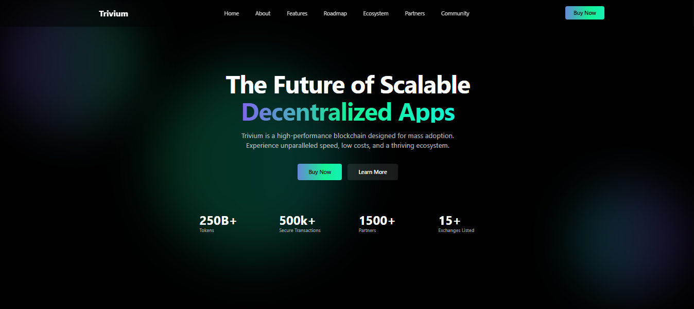

# 🚀 Trivium – Blockchain Landing Page

## 📌 Descripción

Trivium es una landing page moderna enfocada en blockchain y aplicaciones descentralizadas.
Construida con React + TypeScript + TailwindCSS, y creada con apoyo de Google AI Studio, ofrece un diseño minimalista, rápido y responsive, ideal para proyectos Web3 y cripto.

# 🚀 Características

⚡ React + TypeScript para escalabilidad y robustez.

🎨 TailwindCSS para un diseño moderno y responsivo.

📱 Totalmente adaptable a móviles, tablets y desktop.

🎬 Animaciones suaves y estilo profesional.

🔗 Secciones con métricas (tokens, transacciones, socios, exchanges).

# 🛠 Tecnologías

React

TypeScript

TailwindCSS

Google AI Studio

# 📂 Instalación

Clona este repositorio e instala las dependencias:

git clone https://github.com/YoshuaSoto95/trivium-cryptocurrency-landing-page.git

cd trivium-cryptocurrency-landing-page

npm install

# Ejecuta el proyecto en local:

npm run dev

🔗 Ver Proyecto en Vivo : https://triviumcrypto-landing-page.netlify.app/

# 📷 Capturas

## 👨‍💻 Autor
[Dann Kloppering]
- GitHub: [Dann Kloppering](https://github.com/YoshuaSoto95?tab=repositories)
- LinkTree: [Dann Kloppering](https://dannkloppering-linktree.netlify.app/)